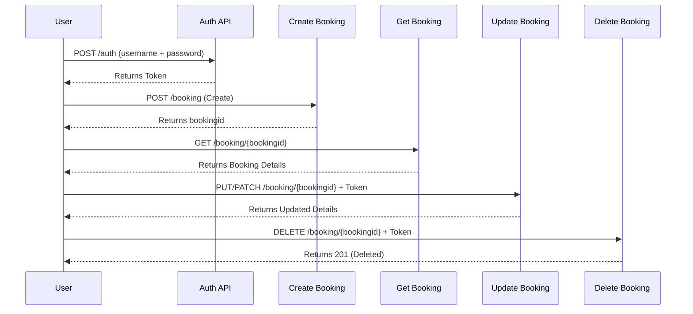

# 🔗 API Chaining – CRUD Operations (Restful Booker)

This project demonstrates **API Chaining** for **CRUD operations** using the [Restful-Booker API](https://restful-booker.herokuapp.com/apidoc/index.html).  
API Chaining means using the **response of one API as input for the next**, mimicking real-world workflows like authentication → create → read → update → delete.

---

## 🚀 Features Covered
- **Authentication** – Get access token  
- **Create** – Create a booking and capture `bookingid`  
- **Read** – Retrieve booking details using `bookingid`  
- **Update** – Modify booking using `bookingid` + `token`  
- **Delete** – Remove booking using `bookingid` + `token`  

---

## 🛠️ Tech Stack
- **Postman** – API Testing & Chaining  
- **JavaScript Tests** – Postman test scripts for validation  
- **Environment Variables** – Store `token` and `bookingid` dynamically  
- **REST API** – [Restful-Booker](https://restful-booker.herokuapp.com/)  

---

## 🔄 API Workflow (Chaining Flow)


├── 📘 README.md  
├── 📑 API_Chaining.postman_collection.json       # Exported Postman collection  
├── 🌐 PROD_Environment.postman_environment.json  # Postman environment with variables  
├── 📊 Newman Reports                             # Test execution reports (HTML)  
```

---

## 🎯 Key Learnings

* How to perform **API Chaining** with dynamic variables.
* Validating responses with **Postman test scripts**.
* Handling **CRUD lifecycle** in a single automated workflow.

---

## 🙋‍♀️ Let’s Connect 👩‍💻

- 📧 **Email:** [sharvarimehta97@gmail.com](mailto:sharvarimehta97@gmail.com)
- 💼 **LinkedIn:** [linkedin.com/in/sharvarimehta](https://www.linkedin.com/in/sharvarimehta) 
- 🔗 **Postman Profile:** [postman.com/sharvarimehta](https://www.postman.com/sharvarimehta)
